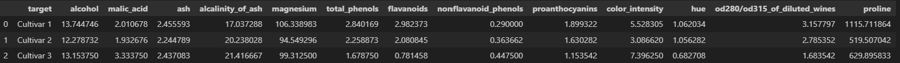

# Final_Bootcamp_Project
This the final machine learning project for data analytics bootcamp.

# Overview
A wine company is seeking a new way to categorize their immense collection of wine. They wish to categorize it by the three different cultivars in which they receive wine.
Our group has been tasked to create a machine learning model that can analyze the wines based on their 13 main components, and accurately predict which cultivar the wine belongs too. 
To best serve our client we decided to have a competition of models. We will present 4 models to compete and at the end the model which is most accurate will be given to the company.
Round 1
Each model will be presented, showing how its built and the accuracy it delivers on predicting data.
Improvements
The models will have a chance to add hyperparameter tuning to increase accuracy
Round 2
The models will present their prediction accuracy and a wine

# Background Information
Data:
Results of a chemical analysis of wines grown in the same region in Italy but derived from three different cultivars. 
The analysis determined the quantities of 13 constituents found in each of the three types of wines.
Data for this project was sourced from UC Irvine and posted publicly to their Machine Learning Repository, found here: https://archive.ics.uci.edu/dataset/109/wine

# Process
<ins>ETL</ins>
The data will be extracted directly from sklearn.datasets. 
<ul>
  <li><code>from sklearn.datasets import load_wine
</code></li>
</ul>

The data was clean and required minimaL transformation. 
1. Combine features (X) and targets (y) into a single DataFrame
2. Check for null values in the DataFrame (we had 0)
3. Group variables by class and calculate averages
4. Reset index
5. Use value mapping. Map numerical values to descriptive names
 

<ins>Descriptive Figures</ins>
Bar charts were made to show the average content of each of the 13 varibles, organized by Cultivar.
Here is an image of one of the bar charts, the rest of them will be included within the sepcific code files below.

<ins>Models</ins>

At this point, 4 models were chosen to test, train, and predict on our data.

1. KNN (K_nearest_neighbors): [KNN_Model_Jack.ipynb](KNN_Model_Jack.ipynb)
2. Logistic Regression: [Project 4.ipynb](Project%204.ipynb)
3. LightGBM: [Luis_Code.ipynb](Luis_Project_4/Luis%27%20Code.ipynb)
4. Random Forest: [Analysis Code - Rick.ipynb](Analysis%20Code%20-%20Rick.ipynb)

The general porocess we followed for model creation is below
1. Split data into testing and training sets
2. Scale the data using StandarsScaler
3. Train the model
4. Test the models prediction accuracy
5. Create confusion matrix.

* Since four models were used, please follow the embedded links above to see the exact code used for each model.

# Results

As seen in the chart, KNN was the least accurate model for this task. All other models reached 100% accurcay in round 1 or in round 2 after some hyperparamter tuning.

